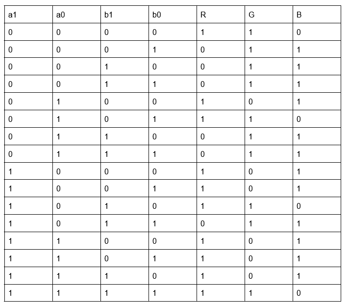
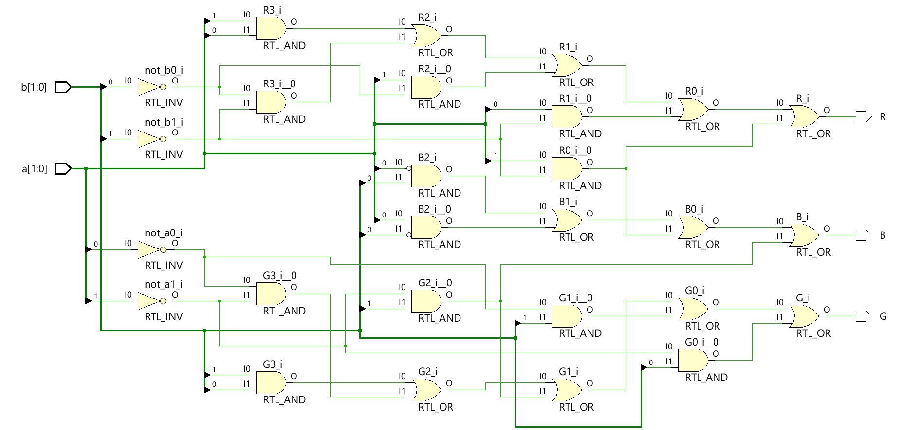

# LAB_4:
Design of a RGB LED's color controller circuit based on the following constraints:

_for a 2-bit a and 2-bit b input:_

```
a>b ->Purple
a=b ->Yellow
a<b ->Cyan
```
## Truth Table:
Considering RGB as independent binary outputs, we have the following table:


## Schematic:
