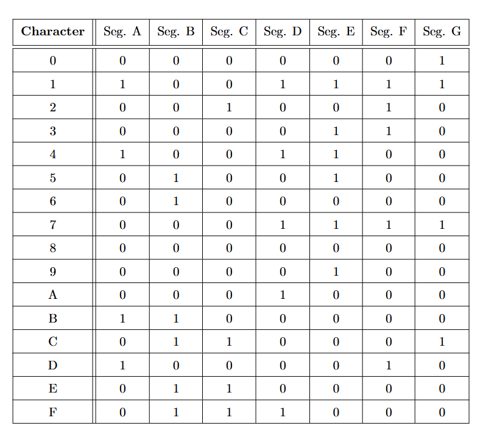
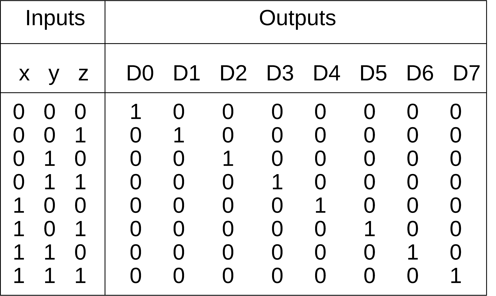
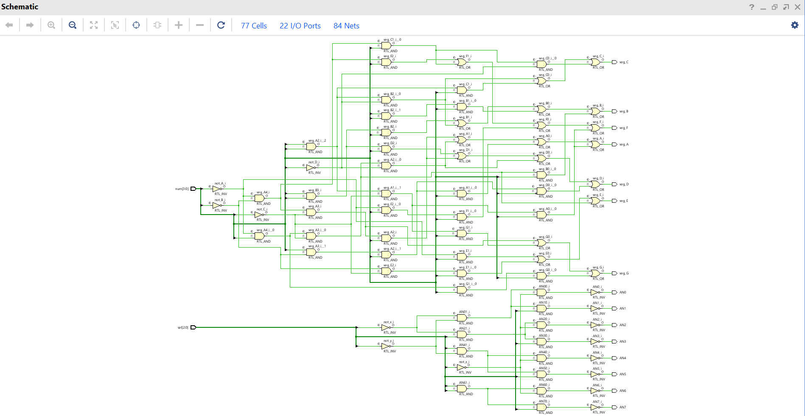
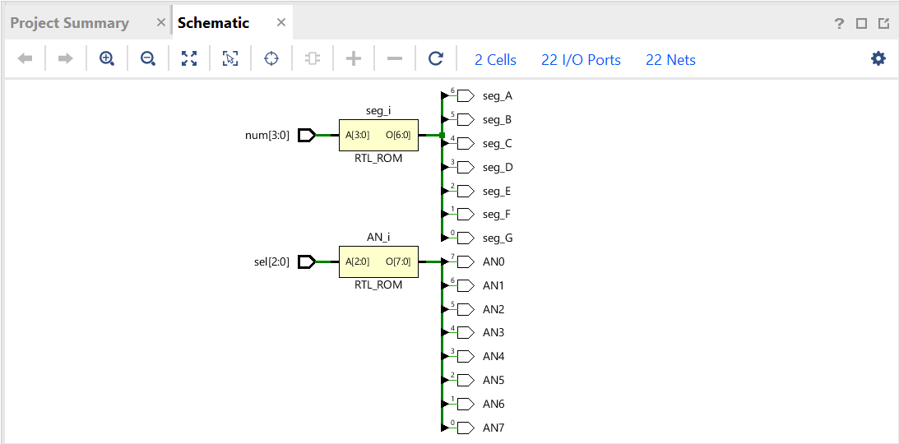

# LAB_5:
Design of a 7-segment driver chip, along with a binary to (inverted)octal decoder for
selection of a particular display on the FPGA.
## Truth Tables:
### Truth table of the chip:

------------

### Truth table of the binary-octal decoder:
The following table has been implemented in an inverted form, because the common anodes were active _low_;

-------------------

## Schematics:
### Structural schematic:

### Behavorial schematic:
